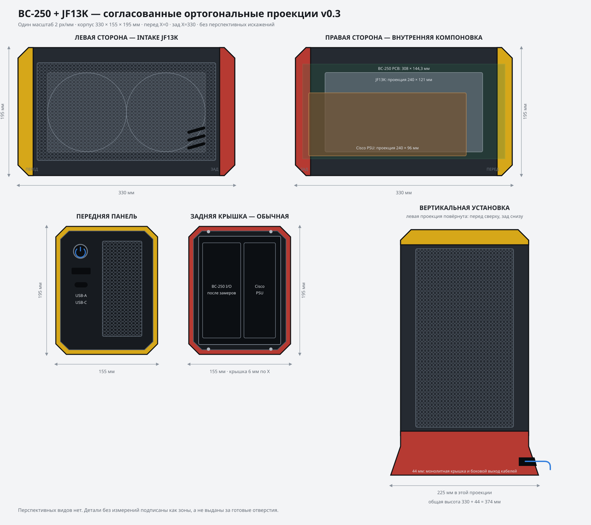

# BC-250 + JF13K compact case

Engineering project for a compact, quiet, 3D-printable Steam Machine-style enclosure built around:

`AMD BC-250 + mounting adapter + JIUSHARK JF13K + modular PSU`

The design is in a controlled recovery and geometry-validation phase. There is currently no printable enclosure release. Previous prototype exports were withdrawn because their mating interfaces did not form a buildable assembly; see [cad/ASSEMBLY-AUDIT.md](cad/ASSEMBLY-AUDIT.md).

## Based on and inspired by

This enclosure is explicitly based on and inspired by two primary community projects:

- [nyacom's AMD BC-250 Industrial Style Case for FlexATX](https://www.printables.com/model/1737913-nyacoms-amd-bc-250-industrial-style-case-for-flexa) - primary exterior design, proportions, end-ring language, and removable-cover concept;
- [NexGen3D DIY Steam Machine PRO V2](https://www.printables.com/model/1793043-nexgen3d-diy-steam-machine-pro-v2-liquid-cooled-bc/files) - power-button assembly, serviceable snap/slot panels, universal PSU mounting strategy, and modular internal architecture.

The later [NexGen3D REDUX Edition](https://www.printables.com/model/1649679-nexgen3d-diy-steam-machine-redux-edition) is retained as a revision cross-check for mechanisms already adopted from PRO V2, plus its editable blank button and later storage/split-cover refinements.

Additional source projects, direct links, adopted features, pinned revisions, and licensing notes are documented in [ATTRIBUTION.md](ATTRIBUTION.md) and [SOURCES.md](SOURCES.md). This is an independent community derivative and is not an official product of the referenced creators or hardware vendors.

## Current direction

- Common chassis for the BC-250 and JF13K assembly.
- Replaceable horizontal and vertical support/base modules.
- Independent replaceable PSU carriers, initially for Cisco UCSC-PSU-650W V02 and later FlexATX.
- Vertical BC-250/JF13K assembly with controlled intake through the broad side panel.
- Serviceable front USB hub, 2.5-inch drive mount, and ESP32 relay-controller tray.

## Project files

- `BC-250-JF13K-agent-context.md` - original project context and priorities.
- `DESIGN-BRIEF.md` - evolving engineering requirements and decisions.
- `BOM.md` - provisional fastener, consumable, filament, electronics, and procurement list with project article numbers and quantities.
- `SOURCES.md` - reference registry, pinned revisions, formats, licenses, and preliminary measurements.
- `ATTRIBUTION.md` - complete credits, direct links, adopted features, and derivative-license notices.
- `docs/FINAL-VISUALIZATION.md` - final Blender/GLB rendering, viewing, and exploded-view delivery plan.
- `TECHNICAL-REPORT-01.md` - superseded horizontal layout study retained as design history.
- `cad/layout-a-envelope.scad` - parameterized collision/envelope model for layout A.
- `cad/exterior-nyacom-v0.2.scad` - replacement exterior direction closely based on the Nyacom industrial case language.
- `cad/NYACOM-ADAPTATION.md` - retained design features, necessary JF13K changes, and derivative-license note.
- `cad/JF13K-PHOTO-FIT.md` - official JF13K envelope, photo/board-model cross-check,
  panel clearance, and remaining physical sanity checks.
- `cad/power-button-nexgen-v0.1.scad` - recreated three-part, backlit, rotatable NexGen-style button module.
- `cad/psu-universal-internal-v0.2.scad` - internal receiver for the common
  NexGen 110 × 46.34 mm server/FlexATX/LOP adapter family.
- `cad/NEXGEN-MECHANISMS.md` - exact NexGen mechanisms selected for reuse and their project-specific constraints.
- `cad/PSU-INTERFACE.md` - fully internal PSU interface and flush-rear requirement.
- `cad/chassis-split-v0.1.scad` - front/rear printable structural sections with an internal alignment collar.
- `cad/CHASSIS-SPLIT.md` - split location, print envelopes, clearance, and retention details.
- `cad/chassis-joint-coupon-v0.1.scad` - reduced-cost three-clearance test of the real chamfered chassis joint.
- `cad/intake-panel-snap-v0.1.scad` - two independently replaceable JF13K intake halves with hidden hooks.
- `cad/fit-calibration-coupon-v0.1.scad` - combined M3/M4 insert, screw-hole, and snap-clearance pre-production test.
- `cad/front-service-module-v0.1.scad` - snap-fit Nyacom front insert with independent button and USB cassette modules.
- `cad/board-spine-v0.1.scad` - split vertical BC-250 carrier using the verified
  308.0 × 144.3 mm bare-PCB envelope and an open backplate area.
- `cad/BC250-DATUM.md` - dimensional source audit and restricted-reference
  handling rules.
- `docs/JF13K-MEASUREMENT-GUIDE.md` - step-by-step Russian measurement and photo
  checklist for an already assembled BC-250 + JF13K module.
- `cad/USB-RETURN-INTERFACE.md` - dual 180-degree adapter envelope and the
  replaceable-insert rule derived from NexGen and seller data.
- `cad/peripheral-bay-v0.1.scad` - removable 7 mm SSD and ESP32 relay-board cassettes.
- `cad/REAR-COVER-VARIANTS.md` - shared portrait I/O/PSU openings and the
  horizontal versus tapered vertical rear-cover construction.
- `cad/ASSEMBLY-AUDIT.md` - authoritative compatibility audit and recovery order.
- `cad/core-assembly-v0.1.scad` - active single-source rebuild of the two-part structural core and accessible seam retention.
- `cad/CORE-ASSEMBLY.md` - core assembly sequence, closed interfaces, and remaining work.
- `cad/REDUX-ADAPTATION.md` - selected Redux mechanisms, measured envelopes, and adaptation constraints.
- `cad/exports/README.md` - authoritative list of STL files currently approved for slicing.
- `cad/support-horizontal.scad` and `cad/support-vertical.scad` - interchangeable support prototypes using a common M4 interface.
- `cad/SUPPORT-INTERFACE.md` - dimensions, fasteners, and unresolved validation points for both orientations.
- `cad/previews/exterior-orthographic-v0.3.svg` - four orthographic projections
  at one scale plus a tower-orientation schematic derived from the left view.
- `references/printables-*` - downloaded reference models retained with their source PDFs and license information.
- `tools/inspect_3mf.py` - small utility for reporting raw 3MF vertex bounds.

## Important

The repository contains third-party reference files under different licenses. Review `SOURCES.md` and the source PDF in each reference directory before reusing or redistributing a model. Reference geometry is not automatically part of the final case design.
