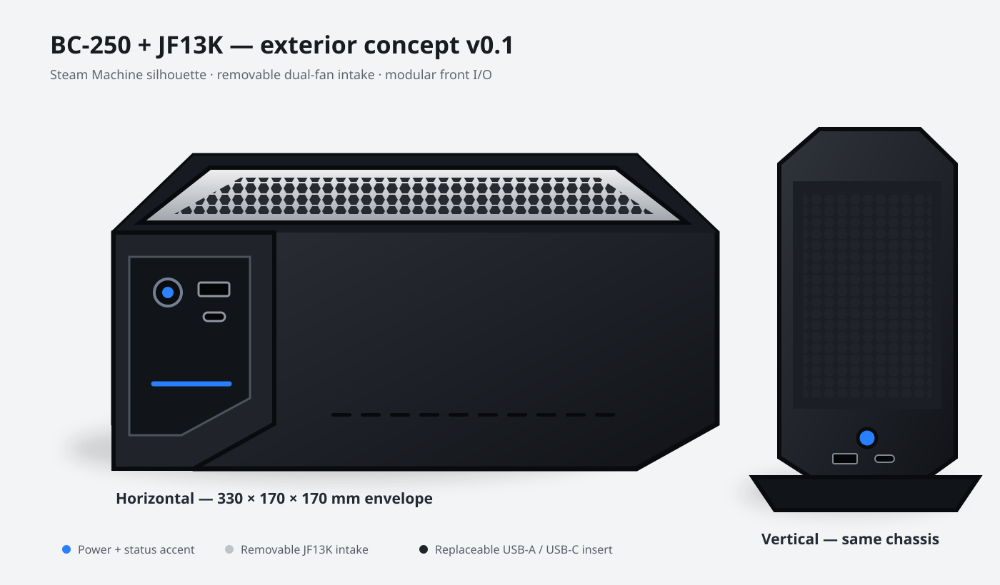

# Exterior concept v0.1

This is the first model intended to communicate the requested enclosure rather than internal collision geometry.



## Design language

- compact longitudinal Steam Machine silhouette;
- dark structural body with a contrasting removable intake panel;
- two circular honeycomb fields positioned above the JF13K fans;
- restrained side exhaust slots instead of fully perforated walls;
- recessed front service insert carrying the power button, USB-A, and USB-C;
- rear service panel remains generic until the BC-250 and Cisco PSU connector coordinates are measured;
- horizontal and vertical presentation are generated from the same body.

## Important limitations

The model is an exterior architecture concept. It is deliberately not labelled print-ready. Wall splits, magnets, heat-set inserts, panel joints, exact USB hub retention, exact rear I/O openings, and structural support for the heavy JF13K remain to be engineered.

OpenSCAD selection:

```scad
orientation = "horizontal";
orientation = "vertical";
```
