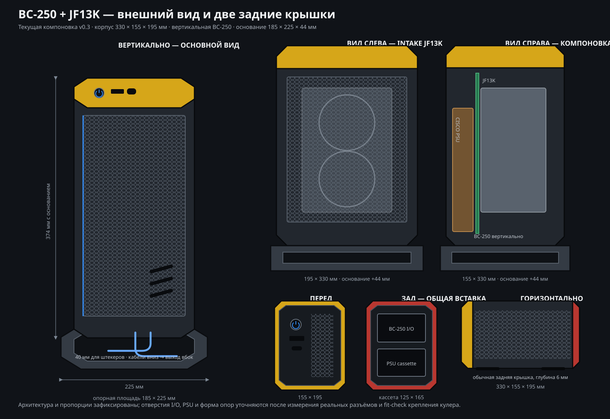

# Nyacom-inspired exterior adaptation v0.2

This replaces the generic v0.1 styling direction.

The visual architecture deliberately follows the supplied Nyacom reference:

- a long, dark octagonal centre tunnel;
- contrasting chamfered end rings;
- recessed front and rear service panels;
- thin colour accent around the removable panel;
- a broad removable cover rather than a conventional PC side wall;
- vertical industrial vent slots and minimal exposed hardware.

The necessary functional change is the broad JF13K intake cover. Two separated 120 mm honeycomb fields replace Nyacom's stock-cooler side-flow arrangement without abandoning the original enclosure language.

## NexGen mechanical features

- The external appearance remains Nyacom-derived.
- The power button uses the NexGen three-part, backlit, rotatable module concept.
- The Nyacom-like broad cover is retained visually but mechanically uses hidden NexGen-style printed snap hooks instead of magnets or visible screws.
- A common internal PSU rail accepts separate Cisco server-PSU and FlexATX adapters.
- Unlike the referenced NexGen implementation, no PSU mount may protrude beyond the enclosure. Only a flush rear interface panel is allowed at the coloured end ring.

This is a derivative design direction based on Printables model 1737913. The reference is licensed CC BY-NC-SA; attribution, non-commercial use, and share-alike requirements therefore apply to derivative geometry. Exact copied meshes are not embedded in this concept file.
