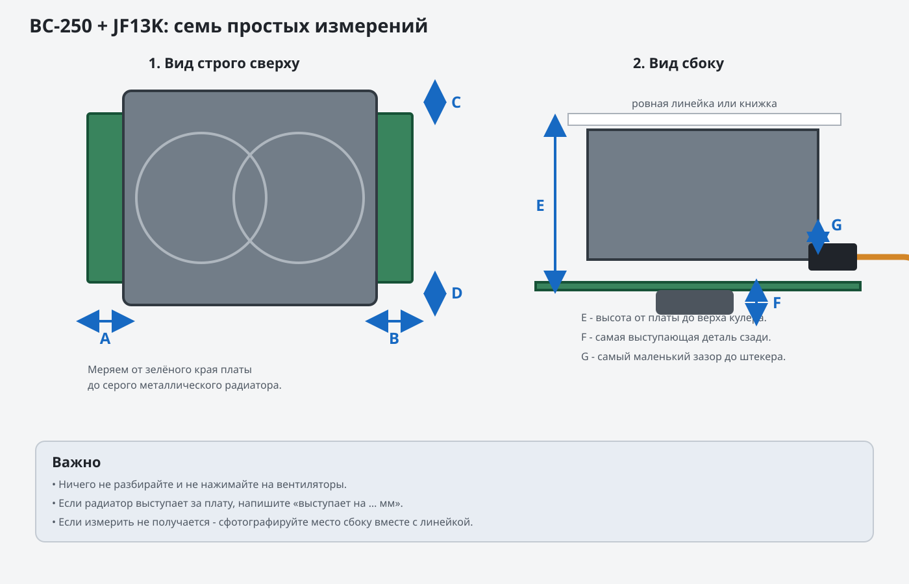

# Как измерить BC-250 с установленным JF13K

> Статус: после сопоставления фотографий сборки с официальным габаритом JF13K
> эта процедура больше не блокирует проектирование корпуса. Она оставлена как
> необязательная финальная проверка перед печатью.

Ничего разбирать и откручивать не нужно. Нужны только:

- обычная линейка с миллиметрами;
- телефон;
- любой второй ровный предмет: другая линейка, угольник или ровная книжка.

Главная схема:



## 1. Четыре расстояния сверху

Положите плату так, чтобы кулер смотрел вверх. Сфотографируйте её строго сверху.

Измерьте расстояние от каждого края платы до края металлического радиатора:

- `A` - слева;
- `B` - справа;
- `C` - сверху;
- `D` - снизу.

Если радиатор выступает за плату, так и напишите: например,
`A = выступает на 12 мм`.

Не измеряйте до вентилятора или провода. Нужен край металлического радиатора.

## 2. Высота кулера

Посмотрите на сборку сбоку. Положите вторую линейку или ровную книжку поверх
кулера, не нажимая на вентиляторы. Другой линейкой измерьте:

- `E` - от поверхности платы до нижней стороны верхней линейки.

Это общая высота кулера над платой.

## 3. Что выступает с обратной стороны

Посмотрите на обратную сторону платы и найдите самую выступающую деталь крепления:
backplate, гайку или конец винта.

Измерьте:

- `F` - насколько эта деталь выступает ниже поверхности платы.

Если измерить неудобно, сделайте хорошую фотографию сбоку с приложенной линейкой.

## 4. Место около разъёма питания

Подключите силовой штекер так, как он будет подключён в корпусе.

Измерьте самое узкое расстояние между штекером/проводом и кулером:

- `G` - минимальный свободный зазор.

Также сфотографируйте это место крупно. Важно видеть, в какую сторону уходит
провод.

## 5. Фотографии

Нужно семь фотографий:

1. Строго сверху на всю плату и кулер.
2. Строго с обратной стороны платы.
3. Слева.
4. Справа.
5. Со стороны верхнего края платы.
6. Со стороны нижнего края платы.
7. Крупно подключённый разъём питания рядом с кулером.

На каждой фотографии положите линейку рядом с платой. Линейка и измеряемая
деталь должны находиться примерно на одинаковом расстоянии от камеры.

## Что прислать

Скопируйте этот текст и впишите числа:

```text
A слева = __ мм / радиатор выступает на __ мм
B справа = __ мм / радиатор выступает на __ мм
C сверху = __ мм / радиатор выступает на __ мм
D снизу = __ мм / радиатор выступает на __ мм
E высота кулера над платой = __ мм
F выступ с обратной стороны = __ мм
G зазор около подключённого питания = __ мм
```

И приложите семь фотографий. Если какое-то место невозможно измерить, просто
напишите `не получилось` и сфотографируйте его с линейкой - этого достаточно.
